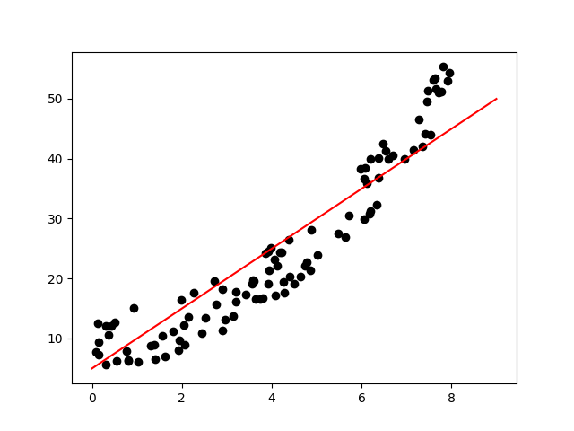

# 📈 Student Marks Prediction (Linear Regression from Scratch)

This project demonstrates my understanding of **machine learning fundamentals** by implementing **linear regression and gradient descent** entirely from scratch — without using any ML libraries such as scikit-learn.  
It predicts student exam marks based on the number of hours they study.

---

## 🎯 Project Goal

To explore the relationship between **study time** and **student performance**, and build a simple predictive model that estimates marks using linear regression.

---

## 🧠 What the Program Does

1. Reads a dataset (`Student_Marks.csv`) containing two columns:  
   - `time_study` – hours spent studying  
   - `Marks` – score obtained by the student  
2. Implements a **custom loss function** and **gradient descent** algorithm.  
3. Updates model parameters (`m`, `b`) iteratively to minimize prediction error.  
4. Visualizes the dataset and the regression line using `matplotlib`.

---

## 🔍 Key Features

- 📊 Pure Python implementation of **Linear Regression**  
- 🔢 Manual computation of **gradients and error**  
- 📈 Visualization of the regression line and data points  
- 🧮 Adjustable parameters: learning rate (`L`) and number of epochs

---

## 🧰 Technologies Used

| Category | Tools |
|-----------|-------|
| Language | Python |
| Libraries | Pandas, Matplotlib |
| Algorithm | Linear Regression with Gradient Descent |

---

## 🚀 What I Learned

Through this project I practiced:
- Implementing machine learning algorithms **from scratch**  
- Understanding the math behind **gradient descent**  
- Data visualization and analysis in Python  
- Debugging iterative models and optimizing hyperparameters  

This project highlights my ability to **understand and implement core ML concepts manually**, not just rely on libraries.

---

## 📈 Example Visualization

The script plots a regression line that predicts marks based on study time:

---
## 🏁 Results Summary

-  Model successfully predicts marks based on study hours
-  Demonstrates understanding of optimization and error minimization
-  Fully implemented with core Python concepts

---

⬅️ [Back to my Portfolio](https://github.com/PiotrWilkowski/portfolio)
